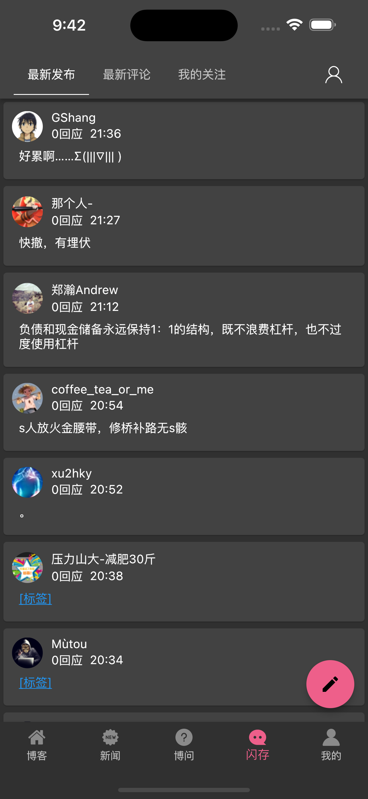

# flutter_cnblog

一个使用Flutter编写的博客园客户端，简单易用并且同时支持Android/Ios平台。

## Features

- 博客园首页
- 新闻
- 博问
- 闪存
- 我的


## Preview

| 博客园首页                   | 新闻列表                    | 博问列表                    |
|-------------------------|-------------------------|-------------------------|
|  |  |  |

| 闪存列表                    | 我的                      | 我的资料                    |
|-------------------------|-------------------------|-------------------------|
|  |  |  |

| 我的博客                    | 阅读记录                    | 知识库                      |
|-------------------------|-------------------------|--------------------------|
|  |  |  |

| 博客内容                     | 粉丝关注                     | 官方博客                     |
|--------------------------|--------------------------|--------------------------|
|  |  |  |


## SetUp
在启动项目之前，需要在根目录创建.env文件。里面包含博客园的id和secret
```properties
clientId={{cnblog_client_id}}
clientSecret={{cnblog_secret_id}}
notRobotCookie=CfDJ8EOBBtWq0dNFoDS-ZHPSe51ATHuFFilG3imii1Hj5WZ-TAK98xT4mJquvSMlYdkzfVCmpAWdt1VyGSpqZ5Q8GulXT3q-Essgs3ttLCLRTzIqo0Klt-nZCkblG6ST2zI2Og
```


## Download
Android

store: https://play.google.com/store/apps/details?id=com.huhx.cnblog

pgyer: https://www.pgyer.com/iwpS
